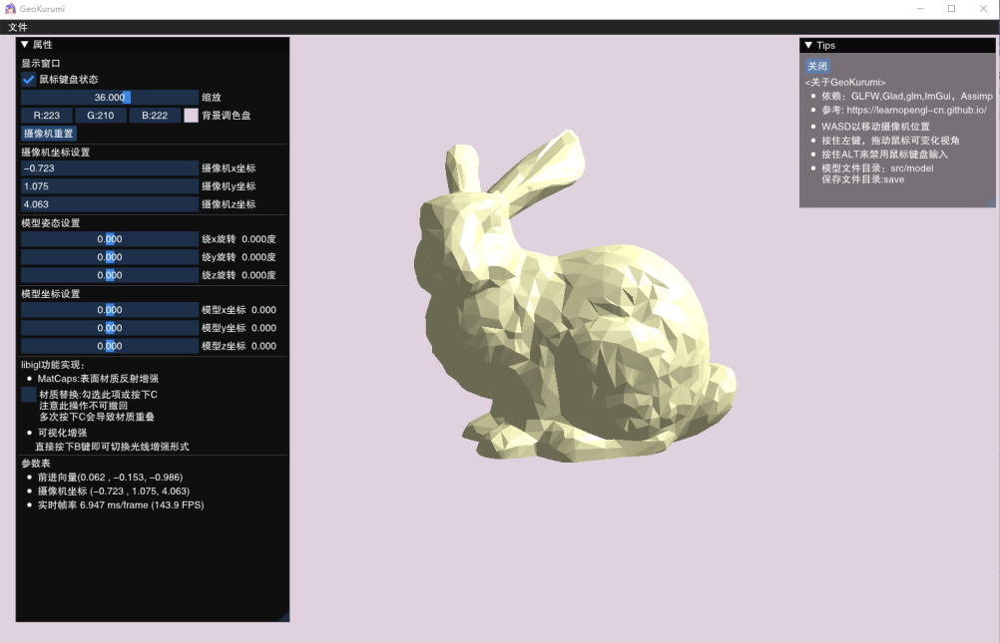

# **README**
## Introduction
* Final Project of ZJU OOP course (Prof. Jijun Li)
* A 3D Model Displayer based on OpenGL.
* ImGui based

## Setup
- Platform: Windows
- Developed on Visual Studio
- The ``.exe`` file is at ``/x64/Release/GeoKurumi.exe``
## Reference
- https://www.cnblogs.com/FKdelphi/p/15250019.html 
- https://learnopengl-cn.github.io/ 
- https://www.bilibili.com/video/BV1Ni4y1o7Au/?spm_id_from=333.337.search-card.all.click
## Contact
- cc98: Apathie
- email: xinyue_yao@outlook.com 
